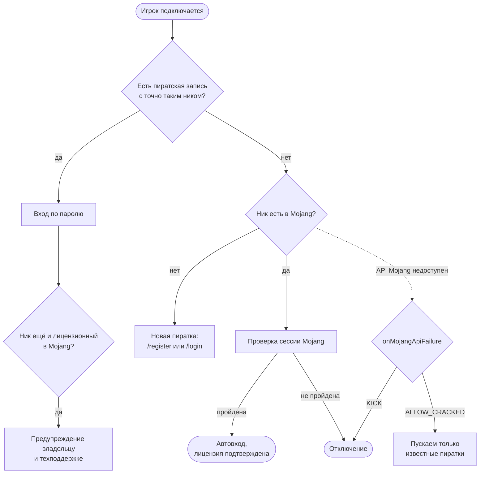
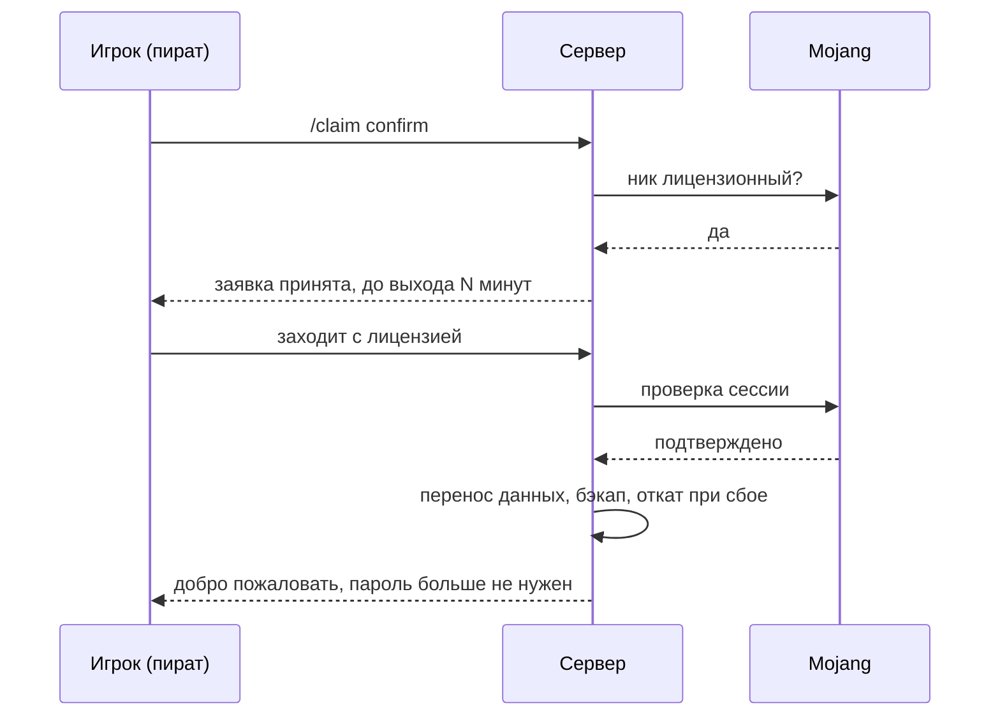

<div align="center">

# 🔐 HybridAuth

**Гибридная авторизация и скины для серверов NeoForge 1.21.1**

Лицензионные игроки входят автоматически, пираты — по паролю, и у всех есть скины.


</div>

Мод ставится **только на сервер**, клиентам ничего устанавливать не нужно. Сервер остаётся в режиме `online-mode=false`: лицензионные аккаунты проверяются через сессионные серверы Mojang, пиратские входят по паролю с кодом восстановления.

HybridAuth также является единственным источником правды о профилях игроков и операциях с whitelist: Discord-модуль `SMPIdentityDiscord` обращается к его API и не считает UUID самостоятельно.

---

## ✨ Возможности

| | |
|---|---|
| 🟢 **Автовход лицензии** | Проверка через Mojang, пароль не нужен. Игрок видит подтверждение в чате и на экране |
| 🔑 **Пароли для пиратов** | PBKDF2-HmacSHA256, 310 000 итераций, код восстановления, защита от подбора |
| 🎨 **Скины для пиратов** | `/skin <ник>` и `/skin url <ссылка>`: скин сохраняется и меняется на лету, без перезахода |
| 🔁 **Перенос на лицензию** | Пират купил лицензию на свой ник: `/claim`, и вещи, прогресс, whitelist и скин переезжают на лицензионный аккаунт |
| 🚚 **Перенос аккаунта** | Все данные пиратки уезжают на новый ник одной командой, с бэкапом и откатом |
| 🛡️ **Защита** | Лимиты попыток, защита от дублей входа, IP-сессии с ограниченным сроком, аудит-журнал |
| 🧩 **API для других модов** | Профили, whitelist и перенос данных аккаунтов |

## 📚 Содержание

- [Как это работает](#-как-это-работает)
- [Установка](#-установка)
- [Команды](#-команды)
- [Скины](#-скины)
- [Перенос на лицензию](#-перенос-на-лицензию-claim)
- [Ники и лицензия](#-ники-и-лицензия)
- [Перенос аккаунта](#-перенос-аккаунта)
- [Настройки](#-настройки)
- [Безопасность](#-безопасность)
- [Для разработчиков](#-для-разработчиков)
- [Лицензия](#-лицензия)
- [История изменений](#-история-изменений)

---

## 🧭 Как это работает



> [!IMPORTANT]
> Пиратская запись на лицензионном нике **не пускает владельца лицензии**. Пирата это не выгоняет: он играет с паролем, пока поддержка не перенесёт его аккаунт на другой ник командой [`/hybridauth transfer`](#-перенос-аккаунта).

## 📦 Установка

1. Положите `hybridauth-<версия>.jar` в папку `mods/` сервера (NeoForge 21.1.x, Java 21).
2. В `server.properties` поставьте `online-mode=false`.
3. Запустите сервер: появятся `config/hybridauth-server.toml` и папка `config/hybridauth/`.
4. По желанию задайте ключ MineSkin для скинов по ссылке (см. [Скины](#-скины)).

> [!NOTE]
> Формат `config/hybridauth/players.json` сохраняется между версиями. Хеши паролей, коды восстановления, даты регистрации и входа и журнал аудита никогда не удаляются. Если UUID записи не совпадает, запись не стирается: конфликт попадает в журнал и ждёт ручного разбора.
>
> При запуске подтверждённые лицензионные записи, ранее попавшие в whitelist с офлайн-UUID, исправляются. Перед любым изменением исходный `whitelist.json` копируется в `config/hybridauth/backups/`, рядом записывается JSON-отчёт. Неизвестные и спорные записи остаются как есть.

## 💬 Команды

### Игрокам (уровень доступа 0)

| Команда | Что делает |
|---|---|
| `/register <пароль> <повтор>` (`/reg`) | Регистрация пиратского аккаунта |
| `/login <пароль>` (`/l`) | Вход по паролю |
| `/changepassword <старый> <новый> <повтор>` | Смена пароля, IP-сессия при этом сбрасывается |
| `/recoverycode` | Выдать новый одноразовый код восстановления (после входа) |
| `/recover <код> <пароль> <повтор>` | Сброс пароля по одноразовому коду |
| `/logout` | Выйти и сбросить IP-сессию: при следующем входе потребуется пароль |
| `/unregister <пароль> <повтор>` | Удалить свой пиратский аккаунт (бэкап делается). Ник освобождается, вещи остаются за ним |
| `/claim`, `/claim confirm` | Перенос пиратского аккаунта на купленную лицензию, см. [Перенос на лицензию](#-перенос-на-лицензию-claim) |
| `/skin <ник>` или `/skin nick <ник>` | Взять скин лицензионного аккаунта |
| `/skin url <ссылка> [classic или slim]` | Сделать скин из PNG по ссылке |
| `/skin model <slim или classic>` | Сменить модель рук у выбранного скина |
| `/skin reset` | Убрать выбранный скин |
| `/skin info` | Показать выбранный скин |
| `/skin help` | Инструкция в игре (то же покажет `/skin` без аргументов) |
| `/skin gallery` | Меню с готовыми скинами: головы с настоящими скинами, выбор одним кликом |

### Администраторам (уровень доступа 3)

| Команда | Что делает |
|---|---|
| `/hybridauth reload` | Полная перезагрузка настроек, включая таймаут и кэш Mojang и ключ MineSkin |
| `/hybridauth backup` | Немедленный бэкап базы авторизации |
| `/hybridauth recovery <ник>` | Выдать игроку одноразовый код восстановления |
| `/hybridauth info <ник>` | Тип аккаунта, UUID, даты регистрации и входа, IP |
| `/hybridauth unregister <ник>` | Удалить аккаунт: бэкап делается автоматически, игрок на сервере отключается |
| `/hybridauth list` | Список аккаунтов (вывод ограничен) |
| `/hybridauth status` | Всего аккаунтов, соотношение лицензия/пиратка, активные сессии, авторизованные онлайн |
| `/hybridauth transfer <старый> <новый>` | Предпросмотр переноса пиратки на новый ник, ничего не меняет |
| `/hybridauth transfer <старый> <новый> confirm` | Выполнить перенос, см. [Перенос аккаунта](#-перенос-аккаунта) |
| `/hybridauth skin <аккаунт> nick <ник>` | Назначить аккаунту скин по нику, без паузы |
| `/hybridauth skin <аккаунт> url <ссылка>` | Назначить скин по ссылке |
| `/hybridauth skin <аккаунт> model <slim или classic>` | Сменить модель рук |
| `/hybridauth skin <аккаунт> reset` / `info` | Сбросить скин или посмотреть его |
| `/hybridauth claim create <ник>` | Оформить заявку на перенос на лицензию вместо игрока (после неё владелец заходит с лицензии) |
| `/hybridauth claim cancel <ник>` / `list` | Отменить заявку или показать действующие |

> [!TIP]
> `unregister` и `info` ищут ник строго с учётом регистра. Если точного совпадения нет, но есть запись с другим регистром, команда подскажет её.

## 🎨 Скины

На офлайн-сервере у всех пиратов скин Стива или Алекс. HybridAuth даёт им настоящие скины.

### Как сменить скин (инструкция для игроков)

**Скин другого игрока.** Введите `/skin <ник>`, например `/skin jeb_`. Ник должен принадлежать лицензионному аккаунту. Посмотреть чужие скины можно на [namemc.com](https://namemc.com).

**Свой скин из файла:**

1. Выложите PNG-файл скина (64×64 или 64×32) на любой хостинг картинок: [imgur.com](https://imgur.com), [postimages.org](https://postimages.org) или отправьте файл себе в Discord.
2. Скопируйте **прямую ссылку на картинку**: она ведёт на сам PNG, а не на страницу с ним (например, `https://i.imgur.com/xxxx.png`).
3. Введите `/skin url <ссылка>`. В конце можно добавить `slim` (тонкие руки) или `classic` (обычные).
4. Через несколько секунд скин сменится у вас и у всех рядом, перезаходить не нужно.

После каждой смены в чате появляется строка **«Руки: … Сменить: [тонкие] [обычные]»**: нажмите кнопку, и модель рук поменяется без повторной загрузки. То же делает `/skin model slim` или `/skin model classic`.

### Как это устроено

- Скин лицензионного аккаунта берётся с сервера сессий Mojang вместе с подписью, ключ не нужен.
- Клиент принимает текстуры только с доменов Mojang. Поэтому ссылка отправляется в [MineSkin](https://mineskin.org): сервис загружает скин на аккаунт Mojang и возвращает подписанную текстуру. Для этого нужен API-ключ в `[skins] mineskinApiKey` (получить: <https://account.mineskin.org/keys>). Скины создаются как `unlisted`. Без ключа работает `/skin <ник>`, а `/skin url` и `/skin model` сообщают, что не настроены.
- Выбор хранится по UUID в `config/hybridauth/skins.json` (атомарная запись, рядом остаётся копия `.bak`) и применяется при каждом входе до того, как игрока увидят остальные.
- При смене скина онлайн всем рядом показывается новый скин, а игроку повторно отправляется состояние мира: ту же последовательность пакетов использует респавн с сохранением всех данных.
- `/hybridauth transfer` переносит скин вместе с аккаунтом, при сбое переноса скин откатывается.
- Лицензионных игроков мод по умолчанию не трогает: у них остаётся скин Mojang. Они тоже могут пользоваться `/skin`, а `/skin reset` вернёт скин, выданный Mojang при входе.
- Скин **не подбирается автоматически по нику**: иначе пират `ReMure` получил бы скин лицензионного `ReMure`.

### Ограничения

| Настройка | По умолчанию | Смысл |
|---|---|---|
| `cooldownSeconds` | 1 | Пауза между `/skin <ник>` и `/skin reset` |
| `urlCooldownSeconds` | 1 | Пауза между `/skin url` и `/skin model` |
| `urlAllowedDomains` | пусто | Разрешённые сайты; пусто — любой публичный. `localhost`, IP-адреса и внутренние имена отклоняются всегда |
| `requestTimeoutSeconds` | 45 | Сколько ждать создания скина в MineSkin |

Один игрок выполняет один запрос за раз. Неудачный запрос паузу не включает. Ответы Mojang кэшируются на 10 минут. Сообщения настраиваются в `[skinMessages]`, в журнал аудита пишутся события `SKIN_SET` и `SKIN_RESET`.

> [!WARNING]
> Ссылка и картинка уходят во внешний сервис MineSkin. Ключ `mineskinApiKey` хранится в `hybridauth-server.toml` открытым текстом: не публикуйте файл и не присылайте его в чаты.

## 🔁 Перенос на лицензию (/claim)

Пират купил лицензию на тот же ник и хочет забрать свои вещи, прогресс и whitelist на лицензионный аккаунт. Без `/claim` это делала только техподдержка.

**Как это выглядит для игрока:**

1. Войти пиратским клиентом под своим ником и ввести `/claim`: мод проверит у Mojang, что ник действительно лицензионный, и покажет, что переедет.
2. Ввести `/claim confirm`: игрока отключит, заявка действует `claimMinutes` минут (10 по умолчанию).
3. Зайти с **лицензионного клиента** под тем же ником. Сервер проверяет лицензию у Mojang, переносит данные и пускает в игру. Пароль больше не нужен, перенос выполняется до входа в мир.



Переносятся те же данные, что и при `/hybridauth transfer`, включая [питомцев и данные других модов](#-перенос-аккаунта). Если на лицензионном аккаунте уже есть данные мира, запись или записи в списках операторов и банов, данные не сливаются: игрок видит причину и обращается в поддержку. Заявку можно оформить и от имени игрока: `/hybridauth claim create <ник>`.

> [!NOTE]
> Пока заявка действует, на этот ник может не пускать с пиратского клиента: вход проверяется как лицензионный. Если игрок передумал, заявка истечёт сама.

## 🧾 Ники и лицензия

### Политика регистра

Пиратские записи хранятся с точным регистром. Намеренная пара, например `ReMure` (лицензия) и `remure` (пиратка), допустима. Лицензионный игрок обязан заходить с каноническим регистром Mojang. Конфликты по точному нику и по UUID никогда не склеиваются молча.

Если пиратская запись уже занимает **точный лицензионный ник** (`ReMure`), пират продолжает входить по паролю, а владелец лицензии войти не может: запись не заменяется, а на экране входа и при таймауте показывается сообщение `licensedNameOccupied`. Оно советует пирату перенести аккаунт, а владельцу лицензии обратиться в техподдержку. Поддержка переносит пиратку командой [`/hybridauth transfer`](#-перенос-аккаунта), после этого владелец лицензии заходит.

### Ники в `/op`, `/whitelist`, `/ban`

Ванильный код приводит ник в этих командах к нижнему регистру и на офлайн-сервере считает по нему UUID. Для ещё не заходившего игрока с ником вроде `ReMure` получался UUID для `remure`, то есть другой человек: whitelist, op и бан не срабатывали. Теперь ник берётся из базы HybridAuth (с настоящим регистром и UUID), а для незнакомого ника UUID считается по нику в том регистре, в котором его ввёл администратор.

### Видимость статуса ника

Игрок всегда видит, лицензионный ли у него ник, и в чате, и на экране (титул и actionbar), чтобы сообщение было заметно в любом лаунчере:

- **Лицензионные игроки** при каждом входе получают подтверждение: ник лицензионный, вход проверен сессионными серверами Mojang.
- **Пираты с ником, занятым в Mojang**, получают предупреждение, что ник принадлежит лицензионному аккаунту. Проверка идёт через общий кэш Mojang и не создаёт лишней нагрузки на API.
- Все эти сообщения, включая причины отключения (`premiumKick`, `mojangApiError`, `invalidUsername`), настраиваются в секции `[messages]` файла `config/hybridauth-server.toml`.

## 🚚 Перенос аккаунта

`/hybridauth transfer <старый> <новый>` переносит пиратский аккаунт на новый ник. Команда нужна, чтобы освободить ник, который занял владелец лицензии, например когда поддержка разбирает пиратскую запись на нике, зарегистрированном в Mojang позже. Сначала показывается предпросмотр, `confirm` запускает перенос.

**Условия.** Оба игрока вне сервера. Старый аккаунт пиратский. Новый ник допустим, не лицензионный в Mojang (если Mojang не отвечает, перенос отказывает), и у него нет аккаунта, данных мира и конфликтов в whitelist, op и банах.

**Что переносится:**

| Данные | Подробности |
|---|---|
| Запись авторизации | Хеш пароля, хеш кода восстановления, даты входа, под новым UUID |
| Данные мира | `playerdata/<uuid>.dat` (поле `UUID` переписывается), `.dat_old`, `stats/<uuid>.json`, `advancements/<uuid>.json`: инвентарь, позиция, опыт и данные модов, лежащие в файле игрока |
| Списки | Whitelist, операторы (с уровнем), бан-лист |
| Скин | Выбранный через `/skin` |
| Питомцы | Приручённые животные (волки, кошки, попугаи, лошади): владелец меняется у загруженных сразу, у остальных при загрузке чанка. Таблица хранится в `config/hybridauth/pet_owner_redirects.json` |
| Данные других модов | Через `com.hybridauth.api.AccountTransfers`, см. [Для разработчиков](#-для-разработчиков). SMPIdentity подключается сам (версия с поддержкой переноса): профиль и все ссылки на него (друзья, репутация, почта, команды) переезжают на новый UUID |

> [!NOTE]
> **Безопасность переноса.** До первого изменения нужные файлы и списки копируются в `config/hybridauth/backups/transfer-<время>-<старый>-to-<новый>/`, бэкап `players.json` создаётся отдельно. Если любой шаг падает, выполненные шаги откатываются в обратном порядке. Бэкап остаётся на диске.

## ⚙️ Настройки

Основные параметры в `config/hybridauth-server.toml`:

```toml
[premium]
	enablePremiumAutologin = true
	onMojangApiFailure = "KICK"
	mojangApiTimeoutMs = 5000
	cacheExpirationMinutes = 10
	autoRepairVerifiedWhitelist = true

[skins]
	enabled = true
	mineskinApiKey = ""
	gallery = ["jeb_", "Dinnerbone", "Notch"]

[cracked]
	registrationsPerIpPerHour = 5
	registrationsGlobalPer10Min = 40
	warnAccountsPerIp = 5

[claim]
	enabled = true
	claimMinutes = 10
```

Кэш профилей Mojang ограничен по размеру и общий для входа и запросов Discord-модуля по whitelist. Запросы идут вне потока сервера, одновременные проверки одного ника объединяются в один HTTP-запрос.

В файле есть разделы: `[general]`, `[premium]`, `[cracked]` (пароли, лимиты, IP-сессии), `[skins]`, `[skinMessages]` и `[messages]` (все тексты для игроков, включая цвета через `§`). Комментарии к параметрам написаны по-русски прямо в файле.

## 🛡️ Безопасность

- **Пароли** хешируются PBKDF2-HmacSHA256, **310 000 итераций**. Старые записи (например, 65 536 итераций) остаются рабочими и незаметно перехешируются при следующем успешном входе. Хеширование идёт в отдельном пуле потоков, не в потоке сервера.
- **Лимиты попыток** двухуровневые: идентичность (`uuid|ник|ip`) блокируется после `maxLoginAttempts` ошибок, а общий счётчик по нику (в 3 раза выше порога) останавливает подбор даже при смене IP. Адрес последнего успешного входа для этого ника не блокируется по нику, поэтому злоумышленник не запрёт владельца с его собственного адреса. Блокировка по идентичности к нему всё же применяется.
- **Регистрации.** Мягкий лимит против ботов: `registrationsPerIpPerHour` (5) с одного IP и `registrationsGlobalPer10Min` (40) на весь сервер. Считаются только удачные регистрации по скользящему окну, поэтому пользователи VPN и общих сетей не блокируются надолго: место освобождается, игрок видит, через сколько минут повторить. Игрока с большим числом аккаунтов на IP мод не блокирует, а **предупреждает администраторов** (чат и журнал аудита, `warnAccountsPerIp`, 5 по умолчанию).
- Неудачные попытки считаются и для незарегистрированных ников, поэтому перебор имён тоже тормозится. `/recover` отвечает одинаково для незарегистрированного ника и для неверного кода.
- **Ники проверяются** (`[A-Za-z0-9_]{3,16}`) на этапе входа до любого запроса в Mojang, потому что мод заменяет ванильное рукопожатие.
- **Порядок протокола** соблюдается: пакет hello или key в неверном состоянии входа отключает клиента.
- **Дубли входа.** Ванилла выгоняет онлайн-сессию с тем же UUID ещё до завершения входа. Пират-новичок с другого адреса отклоняется, пока онлайн авторизованная сессия: выгнать её он не может. Переподключение с того же адреса заменяет зависшую сессию, а вход лицензионного игрока, подтверждённый Mojang, так никогда не отклоняется.
- **Журнал аудита** (`config/hybridauth/logs/auth.log`) ротируется по размеру (5 МБ), хранится до 5 архивов.
- **IP-сессии.** Срок отсчитывается от последнего входа по паролю или лицензии (`sessionDurationMinutes`, по умолчанию 720), использование его не продлевает. Сессия привязана к IP. За общим NAT или у мобильных операторов любой с тем же IP может продолжить сессию до её окончания. Если это важно, поставьте `enableIpSession = false`.
- **`/hybridauth unregister` и `info`** работают только с точным ником. `unregister` прерывается, если не удалось сделать бэкап.

## 🧑‍💻 Для разработчиков

Публичный API HybridAuth отдаёт Discord-модулю определение профилей и операции с whitelist на потоке сервера. Зависимости от Discord и JDA нет: если бот отключён, авторизация в Minecraft не страдает.

Реестр `AccountTransfers` — вторая точка расширения: другие моды подключают сюда перенос своих данных при смене ника.

```java
AccountTransfers.register(new AccountTransferHandler() {
    public String name() { return "SMPIdentity"; }
    public Runnable transfer(AccountTransferPlan plan) throws Exception {
        // перенести данные этого мода с plan.fromId() на plan.toId()
        return () -> { /* откат: вернуть прежние ключи */ };
    }
});
```

Обработчик выполняется на потоке сервера, когда оба аккаунта вне сервера. Он должен либо завершиться полностью, либо бросить исключение, не оставив изменений. Возвращаемый `Runnable` отменяет сделанное: его вызывают, если сорвётся один из следующих шагов.

Каждый пуш и пулл-реквест собирается и тестируется в GitHub Actions (`.github/workflows/build.yml`), для сборки на Linux есть `gradlew`.

Миксины: `PlayerList.placeNewPlayer` (скины при входе), аксессоры `ChunkMap` и `ChunkMap$TrackedEntity` (обновление скина на лету), `GameProfileCache.get` (ники в командах). Порядок пакетов обновления скина на лету адаптирован из [SkinRestorer](https://github.com/Suiranoil/SkinRestorer) (лицензия MIT, © Lionarius), подробности и текст лицензии в [`THIRD_PARTY_NOTICES.md`](THIRD_PARTY_NOTICES.md).

---

## 📄 Лицензия

© 2026 haffkiin. **Все права защищены.**

Исходный код опубликован для ознакомления. Публикация не даёт права копировать, изменять, распространять Программу, запускать её на чужих серверах и использовать коммерчески без письменного разрешения автора. Смотреть код и сообщать об ошибках через Issues можно. Полный текст на русском и английском: [`LICENSE`](LICENSE).

Исключение — адаптированный из SkinRestorer участок модуля скинов: на него действует лицензия MIT, текст в [`THIRD_PARTY_NOTICES.md`](THIRD_PARTY_NOTICES.md).

---

## 📜 История изменений

### 2.1.0

- **Новое: `/claim`.** Пират, купивший лицензию, переносит данные на лицензионный аккаунт сам. Админам: `/hybridauth claim create|cancel|list`.
- **Новое: `/skin gallery`.** Меню-сундук с головами настоящих скинов (список в `[skins] gallery`), выбор кликом, кнопки модели рук и сброса.
- **Новое: `/logout` и `/unregister <пароль> <повтор>`.**
- **Новое: мягкий лимит регистраций** по IP и по серверу и предупреждение администраторам, когда с одного IP набирается много пиратских аккаунтов. VPN не блокируются надолго.
- **Исправлено:** `/op`, `/whitelist add`, `/ban` для ников с заглавными буквами считали UUID по нижнему регистру. Теперь ник берётся из базы, а для новых ников считается в том регистре, в котором введён.
- **Исправлено:** сообщение о занятом лицензионном нике приходило в чат каждые 10 секунд, теперь один раз за вход. Неверный старый пароль в `/changepassword` теперь тоже показывает сообщение.
- **Перенос аккаунта:** питомцы переходят к новому владельцу. SMPIdentity (отдельный репозиторий) переносит профиль и все ссылки на него.
- **Для разработчиков:** автосборка GitHub Actions, скрипт `gradlew` для Linux.

### 2.0.1

- **Лицензия:** репозиторий публичный, все права защищены. Это отражено в файле `LICENSE` и в метаданных мода (`license` в `neoforge.mods.toml`, раньше там было `MIT`). Участок, адаптированный из SkinRestorer, остаётся под MIT.
- Автор и описание мода в метаданных обновлены, описание на русском.
- Комментарии конфига, записи в консоли и тексты ошибок переведены на русский.
- Изменений в работе мода нет, обновление необязательное: достаточно заменить jar.

### 2.0.0 — скины

- **Новое: скины для пиратов.** `/skin <ник>`, `/skin url`, `/skin model`, `/skin reset`, `/skin info`, `/skin help`, админская ветка `/hybridauth skin`. Выбор хранится в `skins.json`, применяется при входе, меняется на лету и переезжает с аккаунтом при `/hybridauth transfer`.
- Выбор модели рук: слово `slim` или `classic` в команде, затем кнопки в чате и `/skin model`.
- Новые разделы конфига `[skins]` и `[skinMessages]`. `/skin url` не работает, пока не задан `mineskinApiKey`.
- Предпросмотр переноса показывает строку про скин, бэкап переноса включает `skins.json`.
- **Исправлено:** подтверждение «ник лицензионный, вход выполнен автоматически» приходило дважды при лицензионном входе, теперь один раз. Сообщение о занятом лицензионном нике снова красно-жёлтое, слово «пиратка» вместо «кракнутый аккаунт».
- Журнал, ошибки и комментарии конфига переведены на русский. Документация переписана.

### 1.3.1

- **Исправлено:** в сообщениях об отключении и в чате больше нет значка на месте переноса строки из конфига (символы CR и LF убираются, переносы заменяются пробелом).

### 1.3.0

- **Безопасность:** дубль входа по нику отклоняется, если онлайн-сессия авторизована и пришла с другого адреса (`duplicateLogin`). Раньше ванилла выгоняла её раньше, чем HybridAuth успевал проверить.
- **Безопасность:** пиратская запись на лицензионном нике больше не пускает владельца лицензии. Он получает сообщение `licensedNameOccupied` на экране входа и при таймауте. Раньше его направляли в пиратскую запись без проверки Mojang. Пират продолжает входить по паролю, пока аккаунт не перенесён.
- **Новое:** `/hybridauth transfer <старый> <новый> [confirm]` переносит пиратский аккаунт (запись авторизации, данные мира, whitelist, op, баны) на новый ник с предпросмотром, бэкапами и откатом. API `AccountTransfers` позволяет другим модам переносить свои данные.
- **Безопасность:** IP-сессии не продлеваются при использовании (абсолютный срок жизни).
- **Безопасность:** блокировка по нику не действует на адрес последнего успешного входа.
- **Безопасность:** `/recover` тормозит неизвестные ники, состояние протокола проверяется в миксинах входа.
- **Исправления:** восстановление whitelist сравнивает ник точно, регистры не склеиваются. Админские `info` и `unregister` больше не ищут без учёта регистра. `unregister` прерывается без бэкапа. Хеширование паролей вынесено из потока сервера. Вторая операция с паролем у одного игрока отклоняется, пока идёт первая (`passwordCheckPending`).
- **Новое:** `WhitelistGateway.AddOutcome.warning` и `IdentityResolver.licensedNickWarning` предупреждают, если пиратский ник совпадает с лицензионным.

### 1.2.0

- **Новое:** постоянно видимые уведомления о статусе ника (чат и титул) для лицензионных входов и для пиратов с лицензионным ником.
- **Новое:** `/changepassword`, админские `info`, `unregister`, `list`, `status`.
- **Новое:** ротация журнала аудита, все сообщения для игроков вынесены в конфиг.
- **Безопасность:** проверка ника в заменённом рукопожатии, `/login` больше не отключает уже авторизованных после исчерпания попыток, PBKDF2 поднят до 310 000 итераций с перехешированием при входе, лимит по нику против смены IP, тормоз для незарегистрированных ников.
- **Исправления:** `/hybridauth reload` применяет таймаут и кэш Mojang, потокобезопасность (volatile в миксине входа, безопасные вызовы сервера), удалены мёртвые настройки (`hideUnauthenticated`, `storageType`) и мёртвый код.
